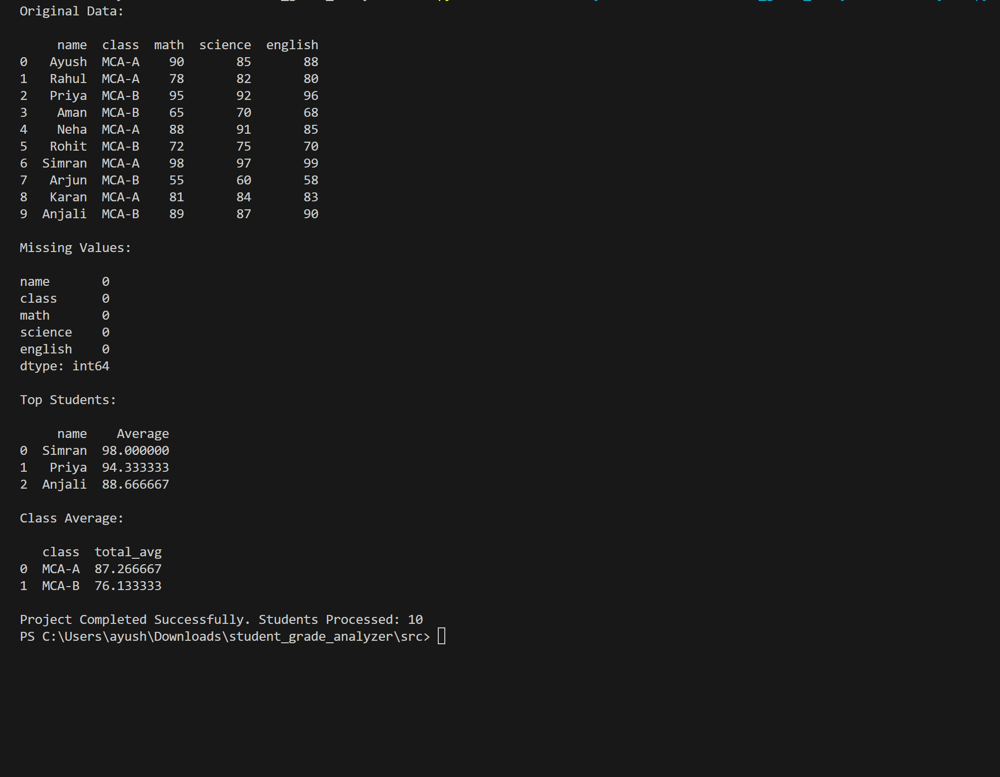

# 🎓 Student Grade Analyzer

## Overview

Student Grade Analyzer is a Python project that reads student marks from a CSV file, calculates totals and averages, assigns grades, stores records in SQLite, and generates reports using SQL queries.

## Features

* Read student data from CSV
* Data cleaning with Pandas
* Calculate Total Marks
* Calculate Average Marks
* Assign Grades Automatically
* Store data in SQLite Database
* Find Top Performing Students
* Calculate Class Average
* Generate Final Report

## Technologies Used

* Python
* Pandas
* SQLite

## Project Structure

```text
student_grade_analyzer
│
├── data
├── screenshots
├── src
├── tests
├── README.md
└── requirements.txt
```

## Project Output



## Future Improvements

* Data Visualization
* Dashboard Development
* Student Search System
* Performance Analytics

## Author

Ayush Singh

MCA Data Analytics

## Project Output

