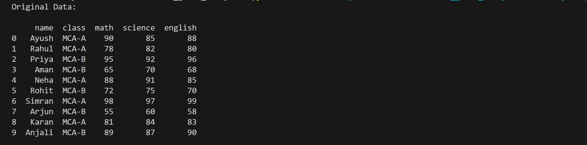
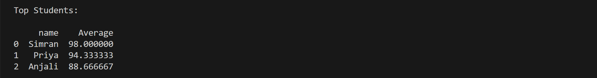
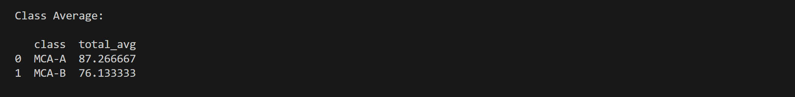

# 🎓 Student Grade Analyzer


A Python-based data analytics project that reads student records from CSV files, calculates totals and averages, assigns grades, stores data in SQLite, and generates analytical reports using SQL queries.

---

## 🚀 Features

* Read student records from CSV
* Clean missing values using Pandas
* Calculate Total Marks
* Calculate Average Marks
* Automatically Assign Grades
* Store Data in SQLite Database
* Find Top Performing Students
* Calculate Class Average
* Generate Final Report

---

## 🛠 Technologies Used

* Python
* Pandas
* SQLite
* SQL

---

## 📂 Project Structure

```text
student_grade_analyzer
│
├── data
│   └── students.csv
│
├── screenshots
│   ├── output1.png
│   ├── output2.png
│   └── output3.png
│
├── src
│   ├── analysis.py
│   ├── database.py
│   ├── queries.py
│
├── tests
│   └── test_analysis.py
│
├── README.md
├── requirements.txt
└── .gitignore
```

---

## 📊 Original Dataset



---

## 🏆 Top Performing Students



---

## 📈 Class Average Analysis



---

## ▶️ How To Run

Clone the repository:

```bash
git clone https://github.com/ayushsinghthapa988-cloud/student-grade-analyzer.git
```

Install dependencies:

```bash
pip install -r requirements.txt
```

Run the project:

```bash
python src/analysis.py
```

---

## 🎯 Future Improvements

* Data Visualization Dashboard
* Streamlit Web App
* Student Search System
* PDF Report Generation
* Performance Analytics Dashboard

---

## 👨‍💻 Author

Ayush Singh

MCA Data Analytics

Galgotias University

GitHub:
https://github.com/ayushsinghthapa988-cloud

---

## ⭐ Learning Outcomes

This project helped me learn:

* Pandas Data Analysis
* Data Cleaning
* SQLite Database Integration
* SQL Queries
* CSV File Processing
* Git & GitHub
* Project Documentation
